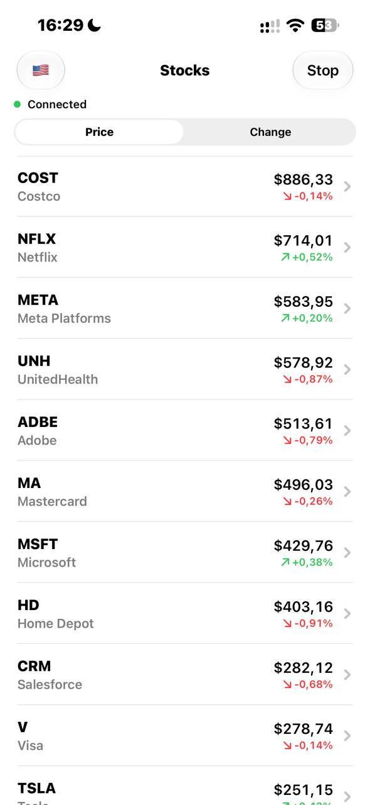
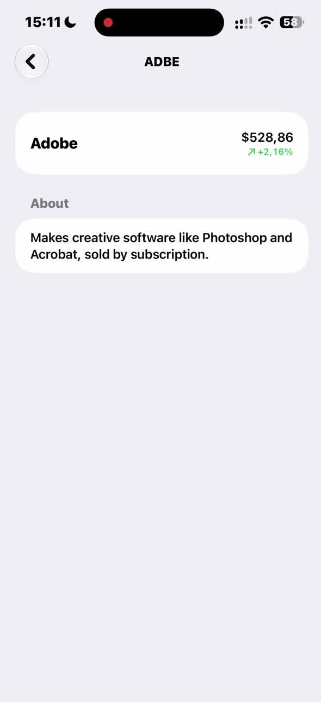
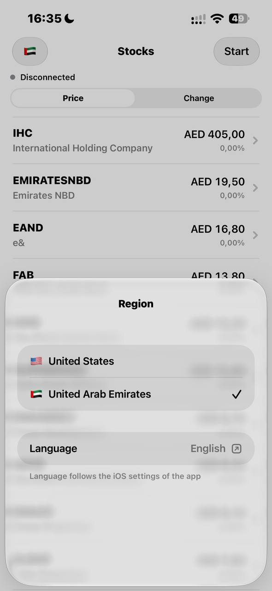
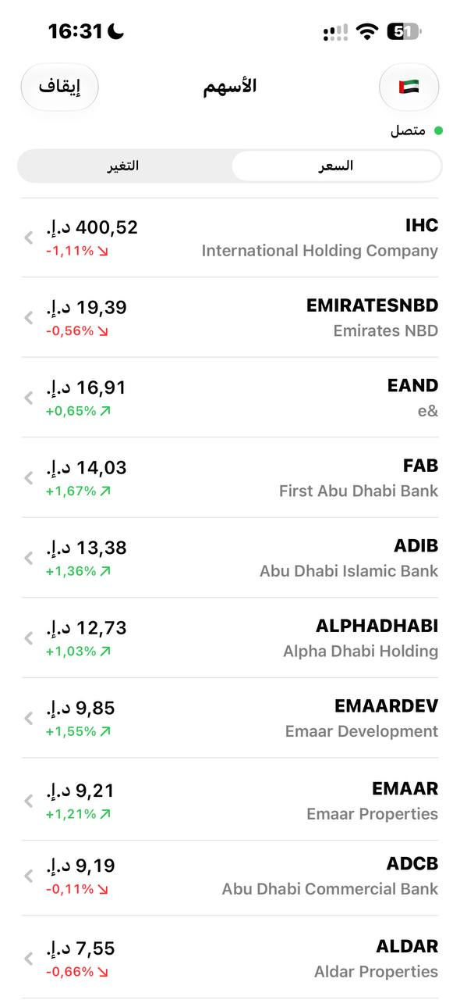

# LiveStocks

Live prices for 25 stocks over a WebSocket echo server, with a details screen per symbol.
Test assignment for MultiBank Group.

<p>
  
  
  
  
</p>

## Running

Xcode 26 or newer, iOS 17+. No third-party dependencies, nothing to install.
Open `LiveStocks.xcodeproj`, pick the `LiveStocks` scheme and run. Press Start to connect.

## Requirements

### Functional

- 25 symbols in a scrollable list: two catalogs of 25, US and UAE.
- WebSocket echo: the app generates a random price, sends it to `ws.postman-echo.com` and renders the echo.
- Each row shows the name, the current price and a change indicator with an arrow.
- Two sort options, by price and by price change.
- Tapping a row opens the details screen.
- Connection status on the list screen: disconnected, connecting, connected, reconnecting.
- A Start/Stop button that controls the connection.
- Details: the symbol as the title, the price with the same indicator, a short description.
- Prices update on both screens at the same time, they read the same object.

### Non-functional

- Correct money: prices are `Decimal`, ticks carry a sequence number and late ones are dropped.
- Resilient feed: reconnect with backoff, a dead connection is detected by missing echoes, the feed pauses in the background and resumes on return.
- Cheap updates: every symbol is its own observable object, a tick redraws one row. Rows are resorted once a second, not on every tick.
- Safe concurrency: Swift 6 strict concurrency, the feed is an actor, Thread Sanitizer is on in the unit test plan.
- Room to grow: seven modules in a local package, screens depend on the domain only and never see the networking code.
- Multi-regional: a market per region with its own catalog and currency, English and Arabic with RTL, Latin digits for prices.
- Tested and automated: three test plans, 55 tests, CI on every pull request, `swift-format` on every build.

## How it works

The app generates a random price for each symbol every two seconds, sends it to `wss://ws.postman-echo.com/raw` and shows what comes back. The echo server stands in for a real market feed.

```
LivePriceFeed (actor), every 2 s
  PriceGenerator → PriceTick → PriceMessage (JSON, price as a string)
        │ send over WebSocketTransport
        ▼
wss://ws.postman-echo.com/raw
        │ echo
        ▼
LivePriceFeed: decode, drop anything that isn't a tick, publish
        │ AsyncStream<PriceFeedUpdate>: .state(ConnectionState) or .tick(PriceTick)
        ▼
QuoteStore (@MainActor, @Observable)
        │ applies the tick to one LiveQuote, drops it if the sequence isn't newer
        ├──────────────────────────────┐
        ▼                              ▼
SymbolsListView                    SymbolDetailsView
  each SymbolRow reads one LiveQuote   reads the same LiveQuote
  SymbolsListViewModel resorts once a second
```

Code lives in a local Swift package, `Packages/LiveStocksKit`:

- `Domain`: quotes, sorting, the `PriceStreaming` protocol and `QuoteStore` that screens read from.
- `Networking`: WebSocket transport, reconnect backoff, JSON serializer.
- `PriceFeed`: the live feed over the echo server, generates prices and reconnects.
- `DesignSystem`: size scale and the price change component.
- `QuotesUI`: formatting a quote for the component, shared by both screens.
- `FeatureSymbolsList`, `FeatureSymbolDetails`: the two screens.
- `DomainTesting`: fixtures and a mock feed, used only by tests.

The app target holds the region configuration, catalogs and `AppContainer` that wires everything together.

Why things are the way they are is in [docs/adr](docs/adr):

- [Local Swift package, no external tools](docs/adr/0001-local-swift-package.md)
- [Shared store, view model only where there is logic](docs/adr/0002-store-and-view-models.md)
- [Money as Decimal, prices as strings on the wire](docs/adr/0003-decimal-money.md)
- [How the feed stays correct](docs/adr/0004-feed-correctness.md)
- [Echo server instead of a market feed](docs/adr/0005-echo-server.md)
- [Regions and languages](docs/adr/0006-regions-and-languages.md)

## Tests

Three test plans, all on CI for every pull request:

- `Unit`: 53 tests with Thread Sanitizer, no network. Feed tests run on a fake transport with millisecond intervals.
- `Integration`: one test against the real echo server.
- `UI`: one test through the main flow, it doesn't depend on the echo server.

```bash
xcodebuild test -project LiveStocks.xcodeproj -scheme LiveStocks -testPlan Unit \
	-destination 'platform=iOS Simulator,name=iPhone 17,OS=latest'
```

More in [TESTING.md](TESTING.md).

## Known limitations

- The echo server is public and sometimes slow, the first prices can take a few seconds after Start.
- Both regions point at the same server. A real app would have a backend per region.
- Company descriptions are in English only, they would come translated from an API.
- No reaction to the network going away, the feed just keeps reconnecting with backoff.
- No VoiceOver labels yet.

## What I'd do next

- `NWPathMonitor` to show "no network" instead of reconnecting into the void.
- Accessibility labels for the rows and the price component.
- A short flash on a row when its price changes.
- Config per environment with xcconfig and a remote catalog instead of the static one.

## Process

Work went through pull requests with CI, `main` only accepts merges from PRs with green checks. Formatting is checked by `swift-format` on every build and on CI.
